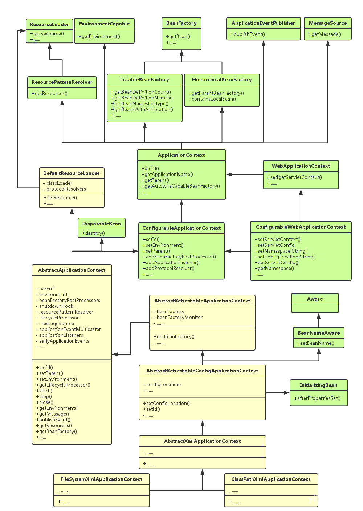
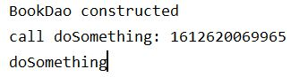

* auto-gen TOC:
{:toc}
# Spring

## 依赖注入(Dependency Injection) *


## IOC容器

### Bean

`ApplicationContext`中的`bean`其实就是Spring帮你`new`好了的对象。

### Spring ApplicationContext容器



两个实现类：`FileSystemXmlApplicationContext`和`ClassPathXmlApplicationContext`

### 使用applicationContext.xml配置容器

```xml
<?xml version="1.0" encoding="UTF-8"?>
<beans xmlns="http://www.springframework.org/schema/beans"
       xmlns:xsi="http://www.w3.org/2001/XMLSchema-instance"
       xsi:schemaLocation="http://www.springframework.org/schema/beans http://www.springframework.org/schema/beans/spring-beans.xsd">
    <!-- 这里配置要用到的bean -->
    <bean id="BookDAO" class="top.chgtaxihe.spring.bean.BookDAO" />
</beans>
```


## Bean实例化

### 无参构造器实例化

`Bean` 需提供一个无参构造器

### 静态工厂实例化

建立工厂类如下：

```java
public class BookDaoFactory {
    public static BookDao getBean(){
        return new BookDao();
    }
}
```

在`ApplicationContext.xml`中如下配置：

```xml
<bean id="bookDao" class="top.chgtaxihe.spring.bean.BookDaoFactory" factory-method="getBean"/>
```

其中`class`指定工厂类，`factory-method`指定获取该`bean`的静态方法

### 实例工厂实例化

工厂类如下：

```java
public class BookDaoFactory {
    public BookDao getBean(){
        return new BookDao();
    }
}
```

`ApplicationContext.xml`配置如下：

```xml
<bean id="beanFactory" class="top.chgtaxihe.spring.bean.BookDaoFactory"/>
<bean id="bookDao" factory-bean="beanFactory" factory-method="getBean"/>
```


## 内部Bean *


## Bean.scope(作用域)

`Bean`有5中作用域

1.  singleton 单例：Bean的默认域，在Spring容器中只有一个实例。
2.  prototype 原型：每次获取Bean时，都会获得一个新的实例

另外3种仅运用在web中，暂不做介绍。


## Bean生命周期callback

### 使用XML

1.  `init-method`: 指定`void`的无参数方法作为初始化callback
2.  `destroy-method`: 指定`void`的无参数方法作为销毁callback

### 使用注解

生命周期（需要导入`javax.annotation-api`）：

1.  @PostConstruct: 构建后调用该方法（同`init-method`）
2.  @PreDestroy: 销毁前调用该方法（同`destory-method`）


## Bean后置处理器

可以通过实现`BeanPostProcessor`接口对Bean进行额外的处理，通过`@Order`设置处理器的先后顺序。

-   `postProcessBeforeInitialization`：在`Bean`的`@PostConstruct`前调用

-   `postProcessAfterInitialization`：在`Bean`的`PostConstruct`后调用

注意：

1.  上述方法调用时，Bean内属性的值已经完成了初始化
2.  若上述方法返回`null`，意味着不再执行后续的后置处理器

```java
@Component
@Order(1)
public class MyBeanPostProcessor implements BeanPostProcessor {
    @Override
    public Object postProcessBeforeInitialization(Object bean, String beanName) throws BeansException {
        if(bean instanceof BookDao){
            System.out.println("table name " + ((BookDao) bean).getTableName());
        }
        return bean;
    }
}
```


## Bean装配

### 使用XML

#### setter注入

需要在`Bean`类中有对应的setter，且在`xml`中配置`<property name="varName" value="varValue"/>`

#### 构造器注入

可以使用带参构造器，使用`constructor-arg`指定参数，xml配置如下：

```xml
<bean id="BookDao" class="top.chgtaxihe.spring.bean.BookDao">
    <constructor-arg index="0" value="science"/>
</bean>
```


### 使用注解

Bean的创建：

1.  @Component: 声明为一个组件(Bean)
2.  @Reposity: 标记为 DAO层，作用同@Component
3.  @Service: 标记为 业务层(Service)，作用同@Component
4.  @Controller: 标记为 控制层，作用同@Component

`@Component("abc")`则相当于在`xml`中声明`<bean id="abc" class="xxx"/>`

值的注入：

1.  @Value: 设置域的值，可作用在域、setter方法上
2.  @Autowired: 默认按照类型注入引用，作用在构造器、域、setter方法上
3.  @Resource: 默认根据实例名注入引用，可指定`name`和`type`
4.  @Qualifier: 与 @Autowired 注解配合使用，会将默认的按 Bean 类型装配修改为按 Bean 的实例名称装配，Bean 的实例名称由 @Qualifier 注解的参数指定。

作用域：

1.  @Scope: 指定Bean的作用域


例子：

```java
@Component("bookDao")
public class BookDao {

    private String tableName;

    public BookDao() {System.out.println("BookDao");}

    public String getTableName() {
        return tableName;
    }

    @Value("science")
    public void setTableName(String tableName) {
        this.tableName = tableName;
    }

    @PostConstruct
    public void init(){
        System.out.println("postConstruct");
    }
}
```


#### @Autowired *


## Spring 事件 *


## Spring AOP *

| 名称                | 说明                                                         |
| ------------------- | ------------------------------------------------------------ |
| Joinpoint（连接点） | 程序执行过程中的某个操作，通常是方法或异常处理               |
| Pointcut（切入点）  | 被（拦截）增强的连接点                                       |
| Advice（通知）      | 指拦截到 Joinpoint 之后要做的事情，即对切入点增强的内容。（`AspectJ`中有`Before`/`After`/`After-returning`/`After-throwing`/`Around`） |
| Target（目标）      | 指代理的目标对象。                                           |
| Weaving（植入）     | 指把增强代码应用到目标上，生成代理对象的过程。               |
| Aspect（切面）      | 切入点和通知的结合。                                         |

Spring提供了3种类型的AOP支持：

-   基于Java代理的经典SpringAOP

-   纯POJO切面

-   @AspectJ


下面介绍使用`AspectJ`实现AOP（待补充代理AOP *）

------

在使用之前，需要添加如下依赖

```xml
<dependency>
        <groupId>org.aspectj</groupId>
        <artifactId>aspectjweaver</artifactId>
        <version>1.9.6</version>
</dependency>
```

----

### 切点表达式

文档：https://www.eclipse.org/aspectj/doc/released/progguide/language-joinPoints.html 第6.2.3节

参考：

-   https://www.jianshu.com/p/37a5ee452edb
-   https://www.cnblogs.com/zhangxufeng/p/9160869.html

表达式中允许使用`&&`/$\mid\mid$/`!`操作符

1.  execution:

    ```java
    execution(modifiers-pattern? ret-type-pattern declaring-type-pattern? name-pattern(param-pattern) throws-pattern?)
    ```

    ​    这里问号表示当前项可以有也可以没有，其中各项的语义如下：

    -   modifiers-pattern：方法的可见性，如public，protected；
    -   ret-type-pattern：方法的返回值类型，如int，void等，可使用通配符`*`
    -   declaring-type-pattern：方法所在类的全路径名，如com.spring.Aspect，可使用通配符`*`
    -   name-pattern：方法名类型，如buisinessService()，可使用通配符`*`
    -   param-pattern：方法的参数类型，如java.lang.String；
    -   throws-pattern：方法抛出的异常类型，如java.lang.Exception；

    在`param-pattern`中，通配符`*`只匹配一个参数，如下例所示：

    ```java
    execution(* set*(*, String))
    ```

    通配符`..`如下例所示：

    ```java
    execution(* top..*.set*(..))
    ```

    代表着匹配`top`包下所有以`set`开头的方法，注意当`..`出现在包名中时，必须以`..*`的形式

2.  within

    ```java
    within(declaring-type-pattern)
    ```

    declaring-type-pattern: 类的全路径名，可使用通配符，表示该类内所有join point（在Spring AOP中仅包含方法的执行）

3.  this *

4.  target *

5.  args

    用于限定并获取参数

    ```java
    @Before("execution(* top.chgtaxihe.spring.bean.BookDao.set*(..)) &&" +
                "args(name, ..)")
    public void beforeSet(JoinPoint joinPoint, String name){
        System.out.println("call " + joinPoint.getSignature().getName() + " with " + name);
    }
    ```

6.  @annotation

    ```java
    @annotation(annotation-type)
    ```

    可通过该参数获得join point的注解

    ```java
    @Retention(RetentionPolicy.RUNTIME)
    @Target(ElementType.METHOD)
    public @interface Log {
        String value();
    }
    ```

    ```java
    @Before("execution(* top.chgtaxihe.spring.bean.BookDao.set*(..)) &&" +
            "@annotation(log)")
    public void logAnnotation(Log log){
        System.out.println("log:" + log.value());
    }
    ```

    注意：注解`Retention`必须为`RUNTIME`

7.  bean

    ```
    bean(bean-name)
    ```

    bean-name: Bean的名称，可使用通配符，表示该Bean内所有的join point（在Spring AOP中仅包含方法的执行）


### 5种Advice

1.  @Before

2.  @AfterReturning

    ```java
    @AfterReturning("com.xyz.myapp.SystemArchitecture.dataAccessOperation()")
    public void doAccessCheck() {
    // ...
    }
    ```

    ```java
    @AfterReturning(
    pointcut="com.xyz.myapp.SystemArchitecture.dataAccessOperation()",
    returning="retVal")
    public void doAccessCheck(Object retVal) {
    // ...
    }
    ```

    注意，`returning`的值要与参数名相同，同时，只会匹配返回值参数类型的函数调用（本例中为`Object`）

3.  @AfterThrowing

    ```java
    @AfterThrowing("com.xyz.myapp.SystemArchitecture.dataAccessOperation()")
    public void doRecoveryActions() {
    // ...
    }
    ```

    ```java
    @AfterThrowing(
        pointcut="com.xyz.myapp.SystemArchitecture.dataAccessOperation()",
        throwing="ex")
      public void doRecoveryActions(DataAccessException ex) {
        // ...
      }
    ```

    注意事项同@AfterReturning

4.  @After

5.  @Around

    >   Around advice is often used if you need to share state before and after a method execution in a thread-safe manner (starting and stopping a timer for example).
    
    ```
    ProceedingJoinPoint
    ```
    
    方法的第一个参数必须是`ProceedingJoinPoint`类型，调用`proceed()`让目标开始执行，且`proceed()`可调用多次（或完全不调用）
    
    同时，该方法的返回值将会传递该join point的原调用者
    
    ```java
    @Around("com.xyz.myapp.SystemArchitecture.businessService()")
    public Object doBasicProfiling(ProceedingJoinPoint pjp) throws Throwable {
        // start stopwatch
        Object retVal = pjp.proceed();
        // stop stopwatch
        return retVal;
    }
    ```
    
    

### 例子

在`xml` 中添加：

```xml
<context:spring-configured/>
```


LogAspect.java:

```java
@Aspect
@Component("logger")
public class LogAspect {

    // 定义Pointcut
    @Pointcut("execution(* top.chgtaxihe.spring.bean.BookDao.doSomething())")
    public void doSomething(){}

    // 如果不定义Pointcut，此处改为
    // @Before("execution(* top.chgtaxihe.spring.bean.BookDao.doSomething())")
    @Before("doSomething()")
    public void before(JoinPoint joinPoint){
        String funcName = joinPoint.getSignature().getName();
        System.out.println("call " + funcName + ": " + System.currentTimeMillis());
    }

}
```

BookDao.java:

```java
@Component("bookDao")
public class BookDao {

    private String tableName;

    public BookDao() {System.out.println("BookDao constructed");}

    public void doSomething(){
        System.out.println("doSomething");
    }
}
```

运行结果：



注意：`LogAspect`必须注册为组件


## Spring JDBC *


