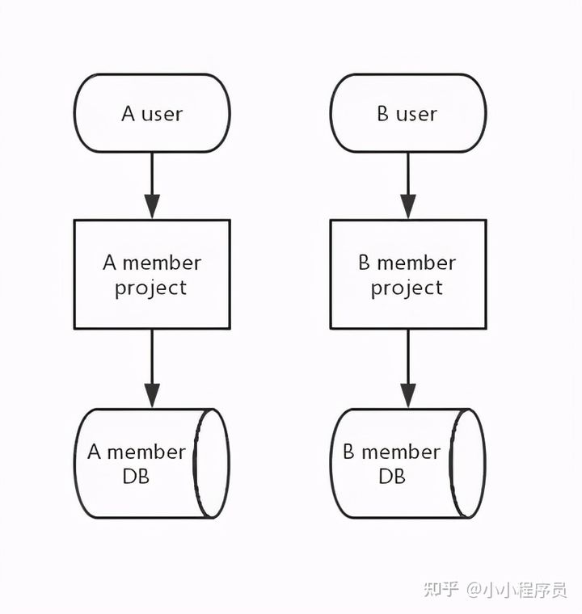

* auto-gen TOC:
{:toc}
# SpringMVC

SpringMVC启动流程？

https://www.w3cschool.cn/spring_mvc_documentation_linesh_translation

https://www.cnblogs.com/wormday/p/8435617.html


## Controller允许的返回值

https://www.cnblogs.com/guo-rong/p/9199511.html

https://blog.csdn.net/u011001084/article/details/52846791


## 零散笔记

-   Spring围绕`DispatcherServlet`设计
-   `ContextLoaderListener `会负责实例化`ApplicationContext`容器


# SpringBoot

https://blog.didispace.com/Spring-Boot%E5%9F%BA%E7%A1%80%E6%95%99%E7%A8%8B/

https://spring.io/guides#topical-guides

如何学习 Spring ？ - 牛岱的回答 - 知乎 https://www.zhihu.com/question/21196869/answer/669550348


### POJO (Plain Old Java Object)


SpringBoot中使用`Jackson`库来将POJO转换为`JSON`


# SOA(Service-Oriented Architecture)

## "烟囱式"系统建设模式

-   多套系统架构相互独立，各自应用独立开发与运维
-   重复功能建设和维护带来的重复投资
-   数据难以打通





## 什么是SOA

>   Service-Oriented Architecture (SOA) is an architectural approach in  which applications make use of services available in the network. In  this architecture, services are provided to form applications, through a communication call over the internet. 

简单来说，系统被拆分成多个服务，而服务之间相互依赖最终提供完整的功能。

可能具有以下性质

-   可从企业外部访问

-   随时可用

-   粗粒度的服务接口分级

-   松散耦合

-   可重用的服务

-   服务接口设计管理

-   标准化的服务接口

-   支持各种消息模式

-   精确定义的服务契约


## REST(Representational State Transfer)

-   表现层（Representation）

    表现即资源的展示方式，资源通过URI来确定

    表现方式是多样的，同一段信息，可以使用Json、XML等格式展示。Http头中`Content-Type`既是对表现形式的描述。

    

-   状态转化（State Transfer）

    状态转化即数据的修改，客户端想要修改数据，必须告知服务端并由服务端来进行修改。

    对于Http来说，使用`GET`/`POST`/`PUT`/`DELETE`来对资源进行操作。


>   综合上面的解释，我们总结一下什么是RESTful架构：
>
>   　　（1）每一个URI代表一种资源；
>
>   　　（2）客户端和服务器之间，传递这种资源的某种表现层；
>
>   　　（3）客户端通过四个HTTP动词，对服务器端资源进行操作，实现"表现层状态转化"。


参考：

-   https://www.geeksforgeeks.org/service-oriented-architecture/
-   https://zhuanlan.zhihu.com/p/348039886
-   《企业IT架构转型之道》
-   https://www.ruanyifeng.com/blog/2011/09/restful.html

阅读：

-   https://www.ics.uci.edu/~fielding/pubs/dissertation/rest_arch_style.htm


# 零星笔记

1.  `@RestController` = `@Controler` + `@ResponseBody`
2.  SpringBoot 打包成Jar 内置Tomcat


## Building a RESTful Web Service

```java
package com.example.restservice;

import java.util.concurrent.atomic.AtomicLong;

import org.springframework.web.bind.annotation.GetMapping;
import org.springframework.web.bind.annotation.RequestParam;
import org.springframework.web.bind.annotation.RestController;

@RestController
public class GreetingController {

	private static final String template = "Hello, %s!";
	private final AtomicLong counter = new AtomicLong();

	@GetMapping("/greeting")
	public Greeting greeting(@RequestParam(value = "name", defaultValue = "World") String name) {
		return new Greeting(counter.incrementAndGet(), String.format(template, name));
	}
}
```

