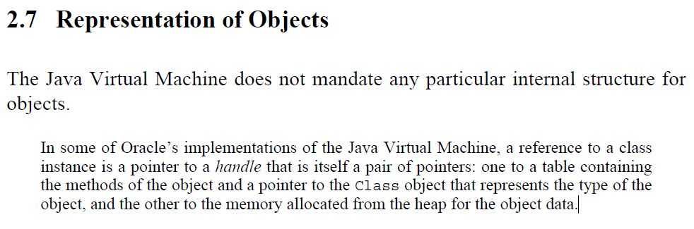

* auto-gen TOC:
{:toc}
>   如果java是一本书，那么《think in java》就是这本书的序与目录。

这里记录着

-   一些容易忘记的Java特性
-   本人读书时遇到/想到的问题
-   少许奇奇怪怪的东西


# Thinking in Java 笔记: 第一章--对象导论

## 前期绑定(Static Binding) 与 后期绑定(Dynamic Binding)

>   1.  静态绑定发生在 **编译期**，动态绑定发生在 **运行时**
>   2.  *private*, *final*, *static* 方法/变量 使用静态绑定
>   3.  静态绑定依靠是Type(*Class* in Java)的信息，而动态绑定依靠*Object*的信息

参考链接: https://javarevisited.blogspot.com/2012/03/what-is-static-and-dynamic-binding-in.html

PS. 第三点中的*Object*个人认为应该指的是*Instance*


### Static Binding 的例子

```java
class Animal{
	static void eat() {
		System.out.println("Animal is eating.");
	}
}

class Dog extends Animal{
	static void eat() {
		System.out.println("Dog is eating.");
	}
}

public class StaticBinding {
	
	public static void main(String[] args) {
		Animal a = new Animal();
		a.eat(); // prints: Animal is eating.
	}

}
```

参考链接: https://stackoverflow.com/questions/19017258/static-vs-dynamic-binding-in-java


### How Does JVM Handle Polymorphism

参考链接: https://www.programmingmitra.com/2017/05/how-does-jvm-handle-method-overriding-internally.html

```java
package chapter1;

public class DynamicBinding {

	private static class Cat{
		public void speak() {
			System.out.println("meow");
		}
	}
	
	private static class Lion extends Cat{
		public void speak() {
			System.out.println("roar");
		}
	}
	
	public static void main(String[] args) {
		Cat cat = new Cat();
		cat.speak();
		
		Cat lion = new Lion();
		lion.speak();
	}

}
```

对上述代码生成的*class*文件进行反编译

```
javap -c chapter1.DynamicBinding
```

得到如下信息


可以看到，`cat.speak()`和`lion.speak()`对应的指令都是`invokevirtual #21`

也就是说，在编译期，这两行代码生成的指令是一样的。


那么JVM到底是如何实现多态的呢？

参考`The Java® VirtualMachine Specification Java SE 8 Edition`（JVM规范）



也就是说，一个引用包含2个指针

-   一个指向 包含对象的函数以及类指针的表
-   另一个指向 该对象在堆中分配的内存空间

通过这一指针，`invokevirtual`指令便可以找到对应的方法引用，进而执行对象的方法。


#### 拓展: virtual method table

>   Whenever a class defines a virtual function (or method), most compilers add a hidden member variable to the class  that points to an array of pointers to (virtual) functions called the  virtual method table. These pointers are used at runtime to invoke the  appropriate function implementations, because at compile time it may not yet be known if the base function is to be called or a derived one  implemented by a class that inherits from the base class.

>虚拟函数表其实就是一个存放指针的指针数组，它里面有一个或者是多个指针，而每一个指针都指向一个虚函数，通过它可以知道虚函数的地址。


# Thinking in Java 笔记: 第二章--一切都是对象

## 堆与栈

Java对象通常存放在堆(heap)（一种内存池）中。

在方法中声明的*对象引用*以及*基本类型*变量则存在于方法栈中。

需要注意的是，如果JVM进行优化，则对象的信息并不一定放在堆中。如: Escape Analysis


# Thinking in Java 笔记: 第五章--初始化与清理

## 方法签名（*method signature*）

>   Two of the components of a method declaration comprise the *method signature*—the method's name and the parameter types.

>   The compiler does not consider return type when differentiating  methods, so you cannot declare two methods with the same signature even  if they have a different return type.

摘自：https://docs.oracle.com/javase/tutorial/java/javaOO/methods.html

例如：

```java
public void doSomething(int a, double b, char c){
    // do something
}
```

该方法的签名是

```
doSomething(int, double, char)
```


## 重载

```java
class OverloadTest {
	
	private static class A{}
	private static class B extends A{}
	private static class C extends B{}
	
	public void doSomething(A info) {
		System.out.println("A");
	}
	
	public void doSomething(B info) {
		System.out.println("B");
	}

	public static void main(String[] args) {
		OverloadTest olt = new OverloadTest();
		olt.doSomething(new A());
		olt.doSomething(new B());
		olt.doSomething(new C());
	}

}
```

上述代码输出为

```
A
B
B
```


## Object.finalize()

>   **Deprecated**.

文档：https://docs.oracle.com/javase/9/docs/api/java/lang/Object.html

使用`Autocloseable`或`PhantomReference`替代


### 拓展：Java的4种引用方式

参考：https://blog.csdn.net/lqw_student/article/details/52947125

1.  强引用

    ```java
    Object o = new Object();
    ```

2.  软引用；Object o = new Object();
    SoftReference sr = new SoftReference(o);

3.  弱引用

    ```java
    Object o = new Object();
    WeakReference weakReference = new WeakReference(o);
    ```

4.  虚引用

    `PhantomReference`，需要结合`ReferenceQueue`使用


## 垃圾回收器如何工作

这个问题几乎可以用一本书的篇幅去写，此处只是简单描述一下

参考资料：https://www.oracle.com/webfolder/technetwork/tutorials/obe/java/gc01/index.html

图片来源：https://www.oracle.com/webfolder/technetwork/tutorials/obe/java/gc01/index.html


### 方案1：标记-清除(Mark-Sweep)

最显而易见的方案

扫描堆中的每一个对象，并给未被引用的对象打上标记。

完成扫描后，将被标记对象删除。


### 方案2：分代收集(Generational Garbage Collection)

当VM中对象不断增加，对象列表不断变大，标记-整理方法效率低下的问题就越发明显，此时就需要一种新的方法。

统计数据告诉我们，Java中大多数对象的生命周期很短，由此可以对内存区域进行划分，分别采用不同的策略以优化性能。

如下如所示

`

-   `Young Generation`：存放新分配的对象
-   `Old Generation`：存放存活时间较长的对象
-   `Permanent Generation`：存放JVM所需的类/方法信息，以及部分Java SE库的类/方法(???)。Java 8取消

------

垃圾回收的步骤如下：

堆起始时为空

1.  新的对象总是被放进`eden`区
2.  当`eden`区满了，进行`minor garbage collection`
    1.  第一次执行`minor GC`时，`eden`区中被引用的对象移动到`S0`，随后清空`eden`
    2.  下一次执行时，`eden`中被引用的对象移动到`s1`，同时，`s0`中被引用的对象亦移动到`s1`，并且“年龄”加一。随后清空`eden`与`s0`
    3.  下一次执行时，重复上述步骤（只不过不再移动到`s1`，而是`s0`）
    4.  `minor GC`执行完后，将年龄达到一定阈值的对象（比如8）移动到`old generation`
3.  当`Old generation`满，执行垃圾回收，称为"Major GC"


### 几种垃圾回收器

1.  The Serial GC

    Java SE 5/6的默认垃圾回收器，采用`mark-compact`的回收方法。

    在回收时需要暂停整个应用程序。

2.  The Parallel GC

    Serial GC的多线程版本

3.  The Concurrent Mark Sweep (CMS) Collector

4.  The G1 Garbage Collector

    Java 7新的回收器，用来取代CMS


## 变量在任何方法(包括构造器)执行前初始化

```java
public class VariableInitialization {

	private static class People{
		int age = getAge();

		private int getAge() {
			return age + 11;
		}
	}

	public static void main(String[] args) {
		People p = new People();
		System.out.println(p.age); // 11
    }
}
```


## enum 类

```java
public class EnumTest {

	private enum Week{
		MON("周一"), TUE("周二"), WED("周三"), 
		THT("周四"), FRI("周五"), SAT("周六"), SUN("周日");

		private String name;
		private Week(String name) {
			this.name = name;
		}

		@Override
		public String toString() {
			return name;
		}
	}

	public static void main(String[] args) {
		for(Week w: Week.values()) {
			System.out.println(w.name() + w.ordinal() + ": " + w);
		}
	}
}
```


# Thinking in Java 笔记: 第六章--访问控制权限

## GCJ(GNU Compiler for the Java Programing Language)

一个可以将Java编译为本地机器码的工具。

Dead Already


## 非Public类下的Public构造方法

`Info`类

```java
package chapter5.packageTest.pkg2;

class Info {
	public Info() {}
}
```

`Pkg1`类

```java
package chapter5.packageTest.pkg1;

public class Pkg1 {

	public static void main(String[] args) {
		Info i = new Info(); // 编译错误
	}

}
```

即使`Info`类的构造方法为`public`，`Pkg1`类亦无法`new`一个`Info`


## 枚举类与Final关键字 *

待完善，参考资料：https://stackoverflow.com/questions/9891613/why-cant-a-java-enum-be-final


# Thinking in Java 笔记: 第八章--多态

## 多态的一个小坑

此问题仅在子类的变量名与父类相同时出现

```java
public class FieldAccess {

	private static class Super{
		public int value = 1;

		public int getValue() {
			return value;
		}
	}

	private static class Sub extends Super{
		public int value = 0;

		public int getSubValue() {
			return value;
		}
	}

	public static void main(String[] args) {
		Super s = new Sub();
		System.out.printf("%d, %d, %d", s.value, s.getValue(), ((Sub)s).getSubValue());
        // 1, 1, 0
	}

}
```


## 构造器内部的多态方法

当父类构造器使用了非`static/final`方法，且子类中重写了该方法时发生。

见下面的例子

```java
public class PolyConstructors {

	private static class Super{

		protected int value = 0;

		void doSomething() {
			value = 1;
		}

		public Super() {
			doSomething();
		}

	}
	
	private static class Sub extends Super{

		@Override
		void doSomething() {
			value = 2;
		}
	}

	public static void main(String[] args) {
		Super s = new Sub();
		System.out.println(s.value); // 2
	}

}
```

输出为2，说明父类调用了重写后的`doSomething`方法


## 初始化顺序

观察下列代码

```java
package chapter9;

public class Page171Exercise3 {

	private static abstract class Super{
		
		Super(){
			print();
		}
		
		abstract void print();
		
	}
	
	private static class Sub extends Super{

		int value = 11;
		
		@Override
		void print() {
			System.out.println(value);
		}
		
	}
	
	public static void main(String[] args) {
		Super s = new Sub();
        // output: 0
	}

}
```

输出为零是因为复杂对象调用构造器遵循以下顺序：

1.  调用基类（父类）构造器（递归）
2.  按照**声明顺序**调用**成员**的初始化方法
3.  调用导出类的构造器主体

当`Super`类调用`print`时，`value`尚未初始化！（将`value`的类型改为`String`，可以看到输出为`null`）


# Thinking in Java 笔记: 第九章--接口

## 抽象类的构造方法

抽象类虽然不能直接创建对象，但抽象类可以有构造方法。

```java
public class AbstractClass {

	private static abstract class AbsClass{
		AbsClass(){
			System.out.println("init1");
		}
	}

	private static class Ins extends AbsClass{
		Ins(){
			System.out.println("init2");
		}
	}

	public static void main(String[] args) {
		Ins i = new Ins();
		// init1
		// init2
	}
}
```


## 接口的default方法 *


# Thinking in Java 笔记: 第十章--内部类

## 内部类使用外部变量

```java
public class InnerClass {
	
	private abstract class Work{
		abstract void work();
	}
	
	String mStr = "123";
	
	Work mWork = new Work() {
		void work() {
			mStr = "abc";
		}
	};

	private void test() {
		final String val = "final field";
		Work w = new Work() {
			@Override
			void work() {
				System.out.println(val);
				mStr = "456";
			}
		};
		w.work();
	}
	
	public static void main(String[] args) {
		InnerClass ic = new InnerClass();
		ic.mWork.work();
		System.out.println(ic.mStr); // abc
		ic.test(); // final field
		System.out.println(ic.mStr); // 456
	}
}
```

在JDK 8以前，**写在方法体中**的匿名内部类访问的局部变量必须显式声明为`final`

JDK8以后，`Effectively final`功能会隐式地添加`final`关键字。


当创建一个匿名内部类的时候，Java自动把引用通过自动生成的构造器复制给新建的对象。换句话说，此时内部类的引用如果发生改变，不会影响到外部类，进而导致数据不一致。

为了避免混淆，Java要求局部变量必须通过final修饰。

当想要向外传递信息时，可以用一个size为1的数组来变通。


参考：

-   https://stackoverflow.com/questions/4732544/why-are-only-final-variables-accessible-in-anonymous-class
-   https://blog.csdn.net/tianjindong0804/article/details/81710268


# Thinking in Java 笔记: 第十二章--通过异常处理错误

## finally块中使用return/continue/break

实例代码：

```java
public class FlowControlInFinally {

	public static void main(String[] args) {
		for(int i=0; i<3; i++) {
			try {
				throw new RuntimeException("exception " + i);
			}finally {
				if(i == 2) break;
				continue;
			}
		}
		
		try {
			throw new RuntimeException("abcd");
		}finally {
			return;
		}
	}
}
```

运行该程序，可以发现“没有”抛出任何异常。

只需要在编译时打开` -Xlint:finally`选项即可发现该问题。

当然，最好的解决办法是**不要在finally中使用流程控制(flow-control)语句**。


# Thinking in Java 笔记: 第十三章--字符串

## 为什么StringBuilder比直接连接String好

StringBuilder内部使用了一个char数组作为缓存（初始大小为`charSequence.length() + 16`）


## 当使用 + 连接字符串时，发生了什么

```java
String a = new String("abc"), b = new String("def"), c = new String("ghi");
String res = a + b + c;
```

编译器将其转化为

```java
res = new StringBuilder(a).append(b).append(c).tostring();
```

而非

```java
res = a.concat(b).concat(c);
```

PS.

-   `concat()`方法与`append()`方法都是使用`Arrays.copyOf()`方法，在**复制**时性能无差别

-   `concat()`方法近似等价于下列代码：

    ```java
    new StringBuilder(a).append(b).toString();
    ```


## CodePoint

>   A *code point* is a value that can be used in a coded character set. A code point is a 32-bit `int` data type, where the lower 21 bits represent a valid code point value and the upper 11 bits are 0.

引自: https://docs.oracle.com/javase/tutorial/i18n/text/terminology.html

Java中使用`UTF-16`编码来存储字符，取值范围为`0x0`到`0x10FFFF`，`CodePoint`即为某个字符在字符表中的编号。

`UTF-16`将编码空间划分为17个平面，每个平面大小为$2^{8}$，其中第一个平面称为基本多语言平面`BMP`，其他平面（`0x10000`到`0x10FFFF`）为辅助平面。

显然，当字符为辅助平面中的字符时，`char`不足以储存该字符，此时，该字符将占用两个`char`。

```java
String testCode = "\uD83D\uDE03";
System.out.println(testCode.length()); // 2
```

需要注意的是，`String.length()`返回的是字符串中`Unicode`码元的数量。


### 如何逐字遍历字符串

```java
String s = "CodePoint: \uD83D\uDE03";
for(int i=0; i<s.length(); ){
    int code = s.codePointAt(i);
    System.out.println("Hex: 0x" + Integer.toHexString(code));
    System.out.println(String.valueOf(Character.toChars(code)));
    i += Character.charCount(code);
}
```


## 为什么String要设计成Immutable *


## String.intern() *


# Thinking in Java 笔记: 第十四章--类型信息

## .class 与 Class.forName()

```java
public class Main {

    private static class Internal{
        static {System.out.println("init");}
    }

    public static void main(String[] args) throws ClassNotFoundException {
        System.out.println(".class");
        Class c = Internal.class;
        System.out.println("Class.forName");
        c = Class.forName(Main.class.getCanonicalName() + "$Internal");
    }

}
// 输出：
// .class
// Class.forName
// init
```

`.class`不会初始化类内部静态域，而`Class.forName()`会


## class.getSuperClass()

```java
private static class Internal{
}

private static class Internal2 extends Internal{
}

public static void main(String[] args) throws ClassNotFoundException {
    Class<? super Internal2> c = Internal2.class.getSuperclass();
    // 不能编译
    // Class<Internal> c2 = Internal2.class.getSuperclass();
}
```

第8行返回的类型是`Class<? super Internal2>`而非`Internal`


# Thinking in Java 笔记: 第十五章--泛型

## 泛型擦除

由于擦除，下列代码无法正常工作

```java
class Erase<T>{
    void doSomething(Object arg){
        if(arg instanceof T){} // Error
        T var = new T(); // Error
        T[] arr = new T[SIZE]; // Error
        T[] arr = (T[]) new Object[SIZE]; //  Warning:未检查的转型
    }
}
```


下列例子可以更清晰的看出泛型擦除的性质

```java
class EraseTest {
	private static class Erase<T extends CharSequence>{
		void doSomething() {
			T[] arr1 = (T[]) new String[5]; // no problem
			T[] arr2 = (T[]) new Object[5]; // ClassCastException
		}
	}
	
	public static void main(String[] args) {
		Erase<String> e = new Erase<>();
		e.doSomething("123");
	}
}
```

在运行时，类型将被擦除至其泛型边界（本例中，边界为`CharSequence`）


## 泛型数组

```java
class EraseTest {

	private static class A{}
	
	private static class Erase<T>{
		T[] arr = (T[]) new Object[5];
	}
	
	public static void main(String[] args) {
		Erase<A> erase = new Erase<>();
		A[] arr = erase.arr; // ClassCastException
		arr[0] = new A();
	}
}
```

上述代码将产生`ClastCastException`，原因在于`erase.arr`的类型实际上是`Object[]`，而

```java
T[] arr = (T[]) new Object[5];
```

在运行时并没有进行强制转型（或者说是由`Object[]`转为`Object[]`，自然不会有任何错误）

随后，由于泛型，`erase.err`被转型为`A[]`（可在反编译出的代码中看到，这一步中包含一类型检查）

```java
A[] arr = erase.arr;
```

----

ThinkingInJava中推荐的做法是，在类的内部直接使用`Object[]`而非`T[]`（即不要转型为`T[]`），又或者传入一个类型标记`Class`，并在新建数组时使用以下方法

```java
class A<T>{
    T[] arr；
    void op(Class<T> type, int length) {
	    arr = (T[]) Array.newInstance(type, length);
    }
}
```


## 通配符

下面的代码很好地说明了通配符的作用：

```java
class WilecareTest {
	
	private static class A{}
	private static class B extends A{}
	private static class C extends B{}

	private static class Holder<T>{
		T obj;
		void set(T arg) {obj = arg;}
		T get() {return obj;}
	}
	
    public static void main(String[] args) {
		Holder<B> origin = new Holder<>();
		
		Holder<? extends B> h1 = origin;
		// h1.set(new B()); 不能编译
		h1.get();
		
		Holder<? super B> h2 = origin;
		h2.set(new B());
		h2.set(new C());
		h2.get(); // 返回Object类型
	}

}
```

-   `Holder<? extends B>`说明其接受**任意一个**泛型类型**继承**自`B`的`Holder`，然而，编译器并不能确定`?`是什么类型（可以是`B`或`C`），因而任何使用`T`作参数的函数均不能被调用；然而对于`get`方法，编译器知道返回值一定继承自`B`，因而可以调用。

-   `Holder<? super B>`说明其接受**任意一个**泛型类型是`B`的**超类**的`Holder`，这里的`?`可以是`Object`/`A` /`B`。对于`set`方法，任意`B`的子类都可以转型为`?`，因而可以调用。对于`get`方法，`?`一定"继承"自`Object`，同样可以被调用（但返回值类型将变为`Object`）。

## 自限定

一些奇奇怪怪的用法（最好不要用上？）

```java
class A<T extends A<T>>{}
```

想要继承`A`时，子类的定义须是

```java
class B extends A<B>{}
class C extends A<B>{}
```

然而，可以这样子绕过：

```java
class D extends A{}
```


# Thinking in Java 笔记: 第十六章--数组

## Comparator.equals

该方法与比较过程无关，仅用于判断两个比较器是否相同。

>   Indicates whether some other object is "equal to" this comparator.

尽管该接口中有`equals`方法，但并不需要"实现"该方法，通常使用`Object.equals`就足够了。


# Thinking in Java 笔记: 第十九章--枚举类型

-   所有` 枚举类T`都继承自`Enum<T>`

-   在枚举类中封装业务逻辑真的好么？


## import static

Java5以后，可以使用以下语法：

```java
// ImportStatic.java
package chapter19.import_static;

import static chapter19.import_static.StaticMethod.method;

class ImportStatic {

	public static void main(String[] args) {
		method();
	}

}

// StaticMethod.java
package chapter19.import_static;

class StaticMethod {

	public static void method() {
		System.out.println("static method");
	}
}
```

`import static`可以导入静态成员（变量/方法）

>   Use it when you require frequent access to static members from one or two classes.


## 枚举类中的抽象方法

枚举类中可以有抽象方法（由于枚举类的对象必须在该类内定义并实例化，因此作用不大？）

```java
enum AbstractEnum {
	
	A {
		@Override
		void doSomething() {
			System.out.println(name());
		}
	}, B {
		@Override
		void doSomething() {
			System.out.println(name());
		}
	}, C {
		@Override
		void doSomething() {
			System.out.println(name());
		}
	};
	
	abstract void doSomething();
	
	public static void main(String[] args) {
		A.doSomething();
		B.doSomething();
		C.doSomething();
	}
	
}
```


## Class Body of An Enum Constant

在乱搞的时候，写出了以下代码

```java
enum InvisiableMethod {
	A{
		public void doSomething() {
			System.out.println("invoked");
		}
	};
	
	public static void main(String[] args) {
		// A.doSomething(); 方法未定义
		System.out.println(A.getClass().getName());
		System.out.println(A.getClass().getSuperclass().getName());
		Method[] methods = A.getClass().getDeclaredMethods();
		for(Method m:methods) {
			System.out.println(m.getName());
		}
	}
}
/* 输出：
chapter19.InvisiableMethod$1
chapter19.InvisiableMethod
doSomething
*/
```

通过反射可以知道`A`所对应的类是`InvisiableMethod$1`，是一个匿名内部类，因此无法直接调用`doSomething`方法。

但仍然可以通过反射得到对应的`Method`对象

文档解释如下：

https://docs.oracle.com/javase/specs/jls/se15/preview/specs/sealed-classes-jls.html

>   **The optional class body of an enum constant implicitly declares an anonymous class ([15.9.5](https://docs.oracle.com/javase/specs/jls/se15/preview/specs/sealed-classes-jls.html#jls-15.9.5)) that (i) is `final`, and (ii) extends the immediately enclosing `sealed` enum type.**

也就是说，枚举类实例的方法体其实是一个**final**内部类


ps1. 实在不知道这个东西应该怎么翻译

ps2. 暂时不知道这个特性有什么用（除了让代码更加难懂以外）


## 使用枚举类实现职责链（别这么做）

-   枚举类是`final`的，意味着其不能被继承，对拓展封闭...
-   个人认为在枚举类中封装业务逻辑违反直觉，不利于查错

```java
enum ResponsibilityChain {

	FIREWALL_HANDLER{
		private static final String DENY_DEST = "1.1.1.1";
		@Override
		boolean handle(String dest) {
			if(dest.equals(DENY_DEST)) return true;
			return false;
		}
		
	}, PROXY_HANDLER{
		private static final String PROXY_DEST = "1.0.0.1";
		@Override
		boolean handle(String dest) {
			if(dest.equals(PROXY_DEST)) return true;
			return false;
		}
		
	}, RESPOND_HANDLER{

		@Override
		boolean handle(String dest) {
			System.out.println("response from " + dest);
			return true;
		}
		
	};
	
	abstract boolean handle(String dest);
	
	public static void main(String[] args) {
		for(ResponsibilityChain handler:ResponsibilityChain.values()) {
			if(handler.handle("127.0.0.1")) break;
		}
	}
}
```


# Thinking in Java 笔记: 第二十章--注解

## 定义注解

```java
@Retention(RUNTIME)
@Target(FIELD)
public @interface AutoIncrease {
	public int begin() default 0;
}
```

注解元素中可用的类型

-   所有基本类型（int, float等）
-   String
-   Class
-   enum
-   Annotation
-   以上类型的数组

注解元素中不能有不确定的值（即不能为null，要么提供默认值，要么在使用时提供）

## 注解解释器与APT *


