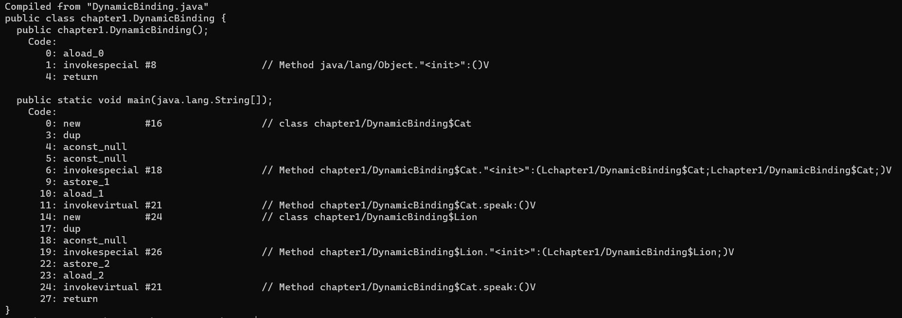

* auto-gen TOC:
{:toc}
# Thinking in Java 笔记: 第一章

>   如果java是一本书，那么《think in java》就是这本书的序与目录。

下面是对书中没有详细展开的内容的补充。

**部分内容已经超出了Java的范畴，作为知识拓展**


## 前期绑定(Static Binding) 与 后期绑定(Dynamic Binding)

>   1.  静态绑定发生在 **编译期**，动态绑定发生在 **运行时**
>   2.  *private*, *final*, *static* 方法/变量 使用静态绑定
>   3.  静态绑定依靠是Type(*Class* in Java)的信息，而动态绑定依靠*Object*的信息

参考链接: https://javarevisited.blogspot.com/2012/03/what-is-static-and-dynamic-binding-in.html

PS. 第三点中的*Object*个人认为应该指的是*Instance*


### Static Binding 的例子

```java
class Animal{
	static void eat() {
		System.out.println("Animal is eating.");
	}
}

class Dog extends Animal{
	static void eat() {
		System.out.println("Dog is eating.");
	}
}

public class StaticBinding {
	
	public static void main(String[] args) {
		Animal a = new Animal();
		a.eat(); // prints: Animal is eating.
	}

}
```

参考链接: https://stackoverflow.com/questions/19017258/static-vs-dynamic-binding-in-java


### How Does JVM Handle Polymorphism

参考链接: https://www.programmingmitra.com/2017/05/how-does-jvm-handle-method-overriding-internally.html

```java
package chapter1;

public class DynamicBinding {

	private static class Cat{
		public void speak() {
			System.out.println("meow");
		}
	}
	
	private static class Lion extends Cat{
		public void speak() {
			System.out.println("roar");
		}
	}
	
	public static void main(String[] args) {
		Cat cat = new Cat();
		cat.speak();
		
		Cat lion = new Lion();
		lion.speak();
	}

}
```

对上述代码生成的*class*文件进行反编译

```
javap -c chapter1.DynamicBinding
```

得到如下信息



可以看到，`cat.speak()`和`lion.speak()`对应的指令都是`invokevirtual #21`

也就是说，在编译期，这两行代码生成的指令是一样的。


那么JVM到底是如何实现多态的呢？

参考`The Java® VirtualMachine Specification Java SE 8 Edition`（JVM规范）


也就是说，一个引用包含2个指针

-   一个指向 包含对象的函数以及类指针的表
-   另一个指向 该对象在堆中分配的内存空间

通过这一指针，`invokevirtual`指令便可以找到对应的方法引用，进而执行对象的方法。


#### 拓展: virtual method table

>   Whenever a class defines a virtual function (or method), most compilers add a hidden member variable to the class  that points to an array of pointers to (virtual) functions called the  virtual method table. These pointers are used at runtime to invoke the  appropriate function implementations, because at compile time it may not yet be known if the base function is to be called or a derived one  implemented by a class that inherits from the base class.

>虚拟函数表其实就是一个存放指针的指针数组，它里面有一个或者是多个指针，而每一个指针都指向一个虚函数，通过它可以知道虚函数的地址。


