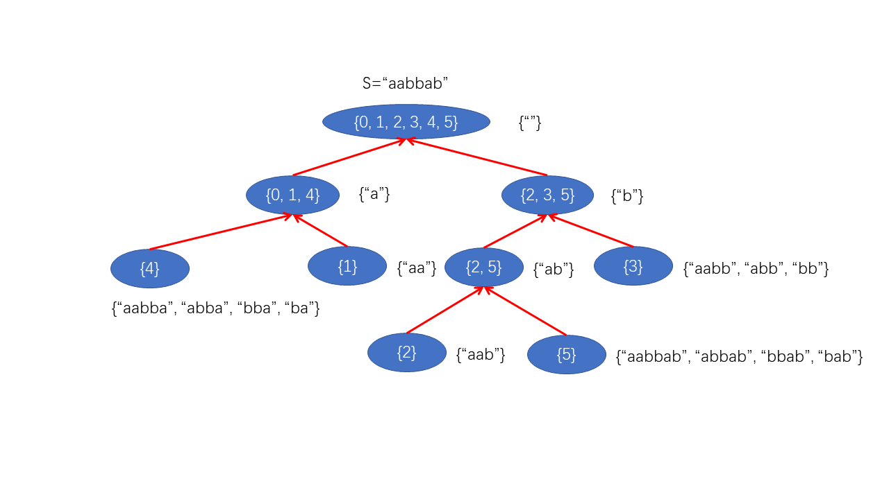
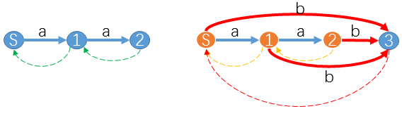
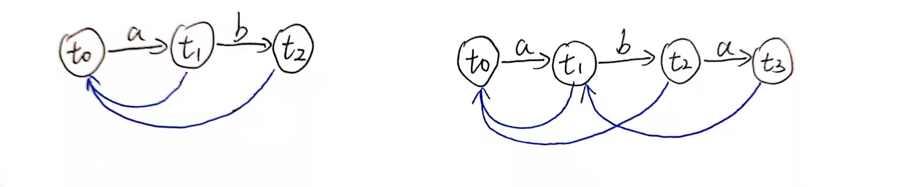
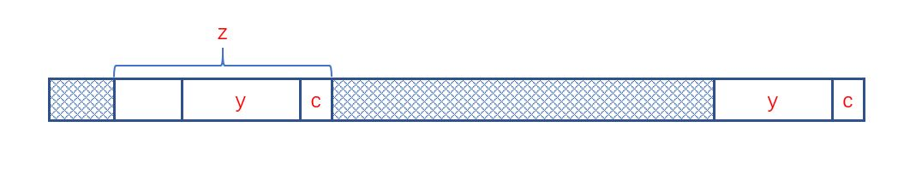
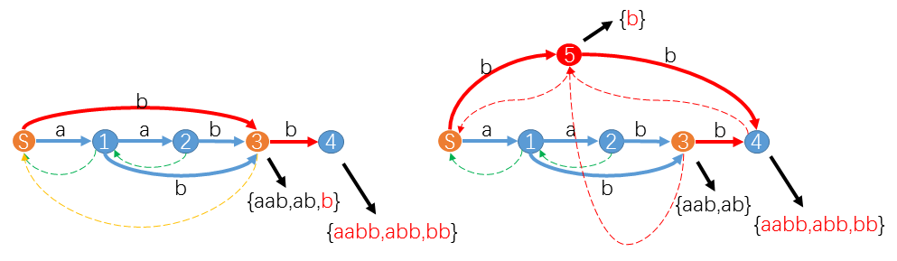

* auto-gen TOC:
{:toc}
# 前言

看见字符串问题就头疼


# 后缀自动机(suffix automaton, SAM)

如果要在一个DAG上表示出一个字符串$S$的所有子串，该如何维护？

一个最简单的方法就是建立一个字典树，并将字符串的所有后缀$Suf_i(S)$插入其中。

显然，在绝大多数情况下，上述方案的时空复杂度都是不可接受的。

----

后缀自动机是一个 `DAG`图 与 一棵由`suffix link`构成的树 的组合。

下面先列出它的部分性质：

-   每一个节点均代表一个状态，边即为状态的转移（有限自动机）
-   每个转移都为一个字符（如'a', 'b'），同一个节点的各个转移互不相同。
-   存在**终止状态**，如果从**初始状态$t_0$**出发，最终转移到终止状态，则转移路径上的所有字符连接起来一定是$S$的后缀。
-   $S$的每一个后缀均可以用一条从$t_0$出发的路径构成。


## 前置定义

### endpos

对于串$S$的非空子串$t$，记$endpos(t)$为其在$S$中的所有结束为止。例如：$S$="abcxabc"，则$endpos(\text{"bc"})=<2, 6>$。

可以根据`endpos`，将串$S$的子串分为若干个**等价类**，上例中，'bc' 与 'abc'属于同一个类。

SAM中，每一个状态对应一类`endpos`。

`endpos`有以下几个性质（理解`suffix link`的时候要用）

-   如果非空子串$u,v$的endpos相同，当且仅当$u$出现时，总是$v$的后缀。

    -   结论显然，证明略

-   对于非空子串$u,v$（假设$\mid u\mid < \mid v\mid$），$u$为$v$的后缀则$endpos(v) \subseteq endpos(u)$，。

    否则，$endpos(u)\cap endpos(v)=\emptyset$

    -   证明：如果$endpos(u),endpos(v)$至少有一个公共元素，由于$u$是$v$的后缀，因此每当$v$出现时，$u$也会出现。


###  后缀链接 suffix link

对于一个状态$v$对应的等价类，记其对应的串的集合为$st(v)$，其中最长的串为$w$。

可知$w$的前几个后缀（w[1:], w[2:], ...）也属于该等价类，而其他所有后缀（至少有一个，即空后缀）属于其他等价类。记不属于$v$的**最长后缀**所在的等价类为$t$，则边$v\to t$即为后缀链接。

举个例子：字符串"aabbab"，A: endpos('aabbab')={5}，B: endpos('ab')={2, 5}，C: endpos('b')={2, 3, 5}，D: endpos('')={0, 1, 2, 3, 4, 5}。使用后缀链接，依次连接$A\to B\to C\to D$

**所有后缀链接构成一颗以初始状态$t_0$为根的树**




## 构造SAM

对于每个节点（状态$t$），我们维护下列信息：

-   $t$所包含的最长子串长度$mx\_len$
-   $t$所包含的最短子串长度$mn\_len$
-   转移数组$trans[]$
-   后缀链接$slink$ 

从上一张图片中我们可以看到，$mn\_len[x]=mx\_len[slink[x]]+1$（证明过程待补充），因此，$mn\_len$不必特意维护。

使用增量法构造SAM，从初始状态（空串）开始，逐个插入字符。

分3中情况讨论

记当前到达的状态为$u$，要插入的字符为$c$。我们新建一个状态$x$

1.  对于后缀路径($u\to t_0$)上的任意状态$v$，若均有$trans[v][c]=NULL$，此时只需要令$trans[v][c]=x$，并设置$slink[x]=t_0$即可。

    由于沿着suffix_link经过的状态均**包含原串的后缀**，直接添加对应的转移即可。

    

    如图所示，向“aa”中插入字符"b"，实线为$trans$，虚线为$slink$

2.  否则，即存在$trans[v'][c]=z$，记该状态$v'=y$。

    若$mx\_len_z=mx\_len_y+1$，此时只需要令$slink[x]=z$即可。

    

3.  否则，我们需要将状态$x$拆分。

    已知$mx\_len_z>mx\_len_y+1$，如下图所示

    

    显然，此时$trans[y][c]=z$对于$\{s\mid len(s)>mx\_len_y+1, s\in z\}$已不再成立，需要将$z$拆分为$\{s\mid len(s)\le mx\_len_y+1,s\in z\}$和$\{s\mid len(s)>mx\_len_y+1, s\in z\}$两部分。

    见代码：

    ```c++
    int w = new_node(mx_len[cur] + 1, mx_len[slink[z]] + 1, slink[z], trans[z]);// new_node(mx_len, mn_len, slink, tran);
    
    slink[z] = slink[x] = w;
    mn_len[z] = mn_len[x] = mx_len[w] + 1;
    
    while(cur != -1 && trans[cur][c] == z){
        trans[cur][c] = w;
        cur = slink[cur];
    }
    ```

    

    

# 模板

```c++
struct SuffixAutomate{
    const static int maxnode = maxlen * 2;
    int mx_len[maxnode], trans[maxnode][26], slink[maxnode];
    int node_cnt = 0, last = 0;

    void init(){
        node_cnt = 0;
        last = new_node(0, -1, NULL);
    }

    inline int new_node(int mxlen, int slk, int * tran){
        mx_len[node_cnt] = mxlen;
        slink[node_cnt] = slk;
        if(tran != NULL){
            memcpy(trans[node_cnt], tran, sizeof(trans[node_cnt]));
        }else{
            memset(trans[node_cnt], -1, sizeof(trans[node_cnt]));
        }
        return node_cnt++;
    }

    void insert_char(char c){
        c -= 'a';
        
        int cur = last, x = new_node(mx_len[cur] + 1, -1, NULL);
        while(cur != -1 && trans[cur][c] == -1){
            trans[cur][c] = x;
            cur = slink[cur];
        }

        if(cur == -1){
            slink[x] = 0;
        }else{
            int z = trans[cur][c];
            if(mx_len[cur] + 1 == mx_len[z]){
                slink[x] = z;
            }else{
                int w = new_node(mx_len[cur] + 1, slink[z], trans[z]);
                slink[z] = slink[x] = w;
                while(cur != -1 && trans[cur][c] == z){
                    trans[cur][c] = w;
                    cur = slink[cur];
                }
            }
        }

        last = x;
    }
}sa;
```


# 应用


参考：

-   https://oi-wiki.org/string/sam/

-   https://www.cnblogs.com/fengzhiyuan/articles/8492566.html

-   https://hihocoder.com/problemset/problem/1441

