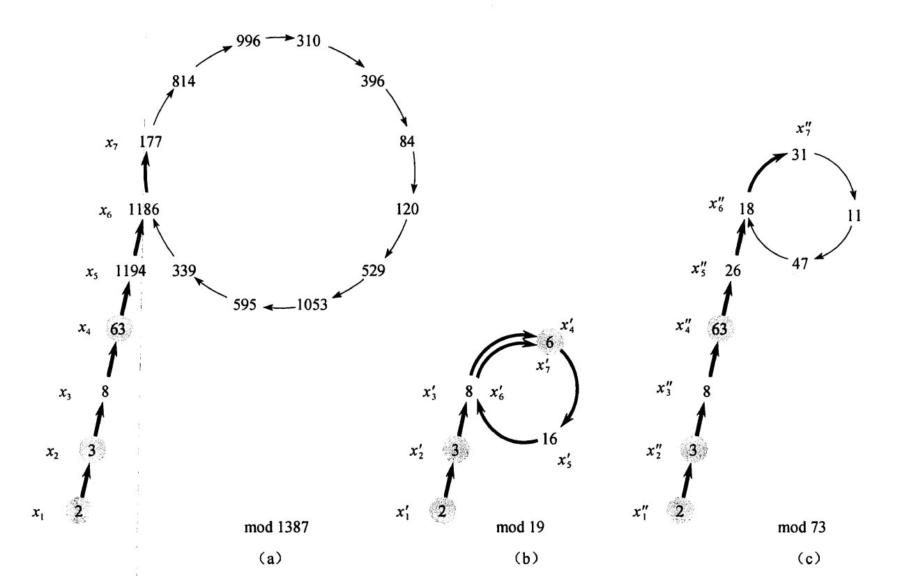

* auto-gen TOC:
{:toc}


# 素性检测


## 前置1. 费马小定理

$$
a^{p-1}\equiv 1 \mod{p}\quad \text{其中p为质数}
$$

简要证明:

对于数列$\{1,2,3,...,p-1\}$，对每个数字计算$f(x)=xa\mod p$，其中$a$为满足$gcd(a,p)=1$的任意整数，得到新的数列$\{1a,2a,3a,\dots,(p-1)a\}$

新的数列有一下性质

1.  $0<x<p$：显然

2.  数列中的数字两两不相同：

    假设原数列中有两个不同数字$c, d$，使得$f(c)=f(d)$，即有$(ac-ad)\equiv 0 \mod p$

    即$a(c-d)\equiv 0 \mod p$，又因为$(a,p)=1$，因此$(c-d)\mid p$

    因此$c-d=0$，$c=d$，矛盾

根据上述性质，可以知道新的数列经过调整位置后可以得到原数列。

因此$1\times2\times\dots\times(p-1)\equiv 1a\times 2a\times \dots\times (p-1)a \mod p$

即$(p-1)!\equiv a^{p-1} \ (p-1)! \mod p$，又因为$(p-1)!$与$p$互质

因此$a^{p-1}\equiv 1 \mod p$


## 前置2. 二次探测

$$
\text{若p为素数，则} a^2\equiv 1 \mod p\quad\text{的解为}\quad a \equiv 1\mod p
$$

简要证明:
$$
\begin{eqnarray}
a^2-1 && \equiv 0 \mod p \\
(a-1)(a+1) &&\equiv 0 \mod p \\
\end{eqnarray}
$$

由于$p$是素数，显然有$(a-1)(a+1)\ne np, n\in Z^+$，因此
$$
a-1\equiv 0 \mod p \quad \text{或} \quad  a+1\equiv 0 \mod p
$$


## 算法思想

设需要判断的数为$p$:

1.  将$p-1$分解为$2^k*t$的形式
2.  若$p$为素数，则定有$a^{2^k*t}\equiv 1\mod p$（对于任意满足$(a,p)=1$的整数）
3.  因而$a^{2^{k-1}*t}\equiv 1$或$-1$（下面省略符号"$\mod p$"）
4.  若上一步同余于$1$，则$a^{2^{k-2}*t}\equiv1$或$a^{2^{k-2}*t}\equiv -1$
5.  ......

多次随机选取不同的$a$，若任意条件不满足，则数$p$不是质数；否则，$p$极大概率是素数


## 算法实现

```c++
// 求余快速幂
long long qpow(long long base, long long t, long long mod) {
    long long res = 1;
    while (t) {
        if (t & 1) res = res * base % mod;
        t >>= 1;
        base = base * base % mod;
    }
    return res;
}

bool Miller_Rabin(long long p) {
    const int TEST_TIME = 8; // 测试8次

    if (p < 2) return false;
    if ((p & 1) == 0) return p == 2;

    long long t = p - 1;
    int k = 0;
    while ((t & 1) == 0) k++, t >>= 1;

    for (int i = 0; i < TEST_TIME; i++) {
        long long a = rand() % (p - 1) + 1; // 通常a可以直接取质数，如:2,5,7,11,...
        long long pow = qpow(a, t, p), last = pow;
        for (int j = 0; j < k; j++) {
            pow = pow * pow % p;
            if (pow == 1 && last != 1 && last != p - 1) return false; // 合数
            last = pow;
        }
        if (pow != 1) return false;
    }
    return true;
}
```


## 正确性

>   The error made by the primality test is measured by the probability for a composite number to be declared probably prime. The more bases *a* are tried, the better the accuracy of the test. It can be shown that if *n* is composite, then at most 1⁄4 of the bases *a* are strong liars for *n*.

能力有限，实在看不懂[这篇文章](https://doi.org/10.1016/0022-314X(80)90084-0)


# 大数分解

先贴出算法的大致流程

```python
from random import randint
from math import gcd

def Pollard_Rho(n: int):
    i, k = 0, 1
    x = randint(0, n - 1)
    y = x
    while True:
        i += 1
        x = (x * x - 1 + n) % n
        d = gcd(abs(y - x), n)
        if d != 1 and d != n:
            return d
        if i == k:
            k <<= 1
            y = x
```

下面来分析一下这个算法：

首先，对于无限序列$[x]$，$x_i$仅由$x_{i-1}$确定（即$x_i=(x_{i-1}^2+1) \mod n$，简记为$x_i=f_n(x_i-1)$），由于$Z_n$是有限的，该序列一定会产生自身重复（回路），如下图(a)所示。由生日悖论可得，出现重复之前，预期执行步数为$O(\sqrt{n})$。



假设$n$是一个合数，设$n$的某一个非平凡因子为$p$

对于序列$<x'>$，其中$x'_i=x_i\mod p$，则该序列满足$x'_i=f_p(x'_{i-1})$（证明略）

因此序列$<x'>$进入循环前预期执行步数为$O(\sqrt{p})$

令$t$为$<x'>$中第一个出现重复的值的下标，$u$表示循环长度，则$x'_{t+i}=x'_{t+i+u}$，若$x_{t+i}\ne x_{t+i+u}$，则$n\mid(x_{t+i}-x_{t+i+u})$，此时便找到了$n$的一个非平凡因子。

因而，当执行循环直至 $k$(见代码) 大于$u$时，在不改变$y$的前提下，沿着环走一圈，便能遇到$x_i\equiv y\mod p$，此时便发现了$n$的一个因子。


参考：《算法导论》第三版


Ps. 显然，序列$<x>$对应的$u$与$<x'>$对应的$u'$满足$u\ge u'$

----

可以发现，每一步都得执行一次`gcd`，其复杂度为$O(log n)$，而这部分是可以被优化掉的。
$$
gcd(a,b)=gcd(ac \mod b, b)
$$
因此，我们可以一段长度内的$(y-x_i)$乘起来，再一起计算`gcd`


## 模板

```c++
ll Pollard_Rho(ll x){
    ll a = 0, c = rng() % (x - 1) + 1, b = c, mul = 1, tmp;

    int max_step = 1, step = 0;
    while(true){
        b = f(b, c, x);
        mul = mul_mod(mul, abs(a - b), x);
        if(mul == 0) return x;
        step++;
        if(step == max_step){
            tmp = __gcd(mul, x);
            if(tmp != 1) return tmp;
            max_step <<= 1;
            a = b;
        }
    }
}
```


# 例题 洛谷P4781

>   对于每个数字检验是否是质数，是质数就输出`Prime`；如果不是质数，输出它最大的质因子是哪个。

AC代码如下

```c++
#include <bits/stdc++.h>
#define ll long long
#define ull unsigned long long
#define int128 __int128_t
#define Android ios::sync_with_stdio(false), cin.tie(NULL)
using namespace std;

mt19937 rng(chrono::steady_clock::now().time_since_epoch().count());

ll mul_mod(ll a, ll b, ll mod){ // 用一般的龟速乘会溢出
    return (a*b-(ll)((long double)a/mod*b)*mod+mod)%mod;
}

ll qpow(ll base, ll t, ll mod) {
    ll res = 1;
    while (t) {
        if (t & 1) res = mul_mod(base, res, mod);
        t >>= 1;
        base = mul_mod(base, base, mod);
    }
    return res;
}

bool Miller_Rabin(ll p) {
    const int TEST_TIME = 8; // 测试8次

    if (p < 2) return false;
    if ((p & 1) == 0) return p == 2;

    ll t = p - 1, k = 0;
    while ((t & 1) == 0) k++, t >>= 1;

    for (int i = 0; i < TEST_TIME; i++) {
        ll a = rng() % (p - 1) + 1; // 通常a可以直接取质数
        ll pow = qpow(a, t, p), last = pow;
        for (int j = 0; j < k; j++) {
            pow = mul_mod(pow, pow, p);
            if (pow == 1 && last != 1 && last != p - 1) return false; // 合数
            last = pow;
        }
        if (pow != 1) return false;
    }
    return true;
}

inline ll f(ll val, ll c, ll mod){
    return (mul_mod(val, val, mod) + c) % mod;
}

ll Pollard_Rho(ll x){
    ll a = 0, c = rng() % (x - 1) + 1, b = c, mul = 1, tmp;

    int max_step = 1, step = 0;
    while(true){
        b = f(b, c, x);
        mul = mul_mod(mul, abs(a - b), x);
        if(mul == 0) return x;
        step++;
        if(step == max_step){
            tmp = __gcd(mul, x);
            if(tmp != 1) return tmp;
            max_step <<= 1;
            a = b;
        }
    }
}

void get_max(ll x, ll & ans){
    if(x <= ans || x <= 1) return;
    if(Miller_Rabin(x)){
        ans = max(x, ans);
        return;
    }
    ll p = x;
    while(p >= x) p = Pollard_Rho(x);
    while(x % p == 0) x /= p;
    get_max(p, ans);
    get_max(x, ans);
}

void solve() {
    long long x;
    ll ans = 0;
    cin >> x;
    if(Miller_Rabin(x)){
        cout << "Prime\n";
    }else{
        get_max(x, ans);
        cout << (long long) ans << endl;
    }
}

signed main() {
    Android;
    int t;
    cin >> t;
    while (t--) solve();
}
```

